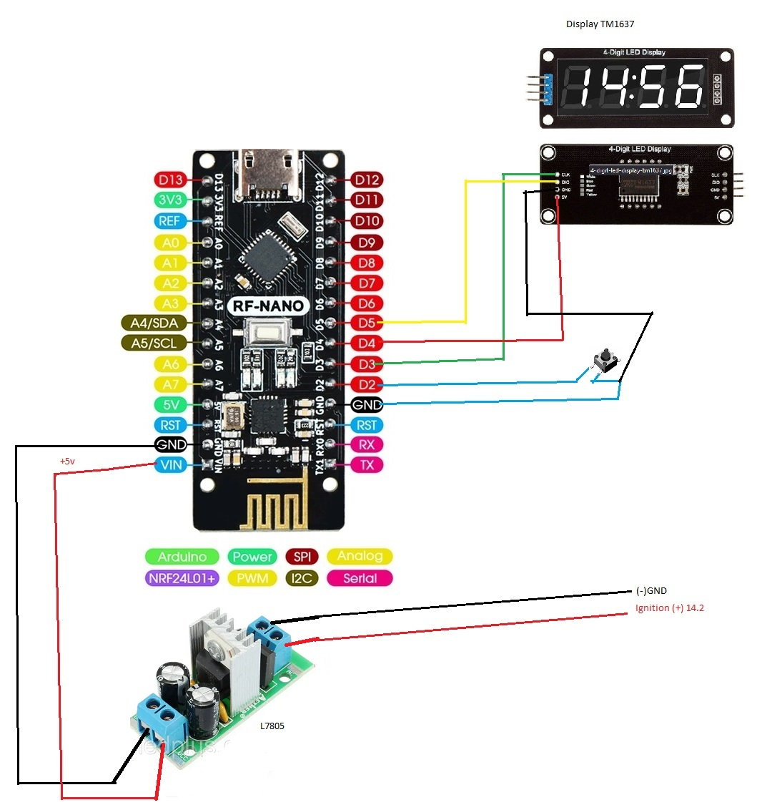
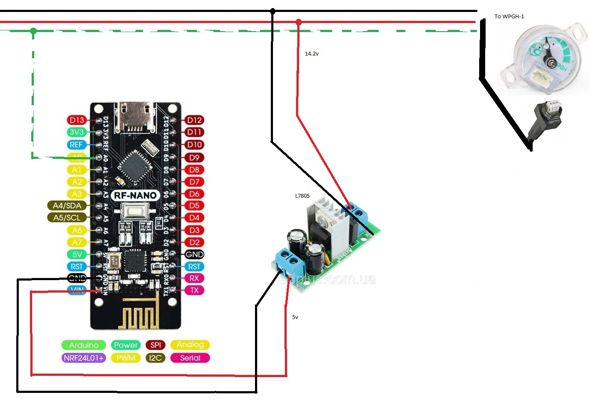

# LPG-computer

Список деталей

 1. Arduino RF-Nano V3.0 ATMega328P CH340 - 2 шт.
 2. Будь який стабілізатор напруги до 5в. (L7805) - 2 шт.
 3. Дісплей TM1637 - 1 шт.
 4. Кнопка - 1 шт.

Приймач

Передавач
