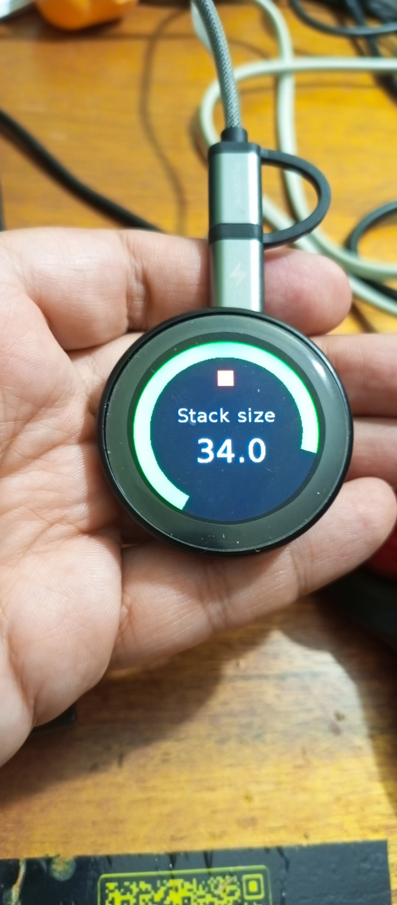
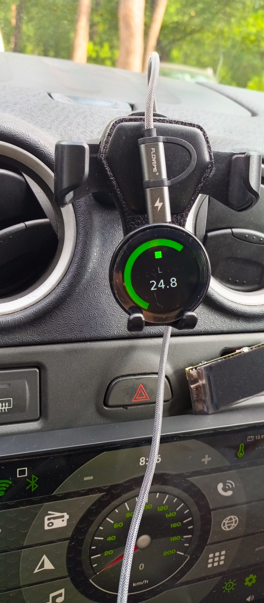
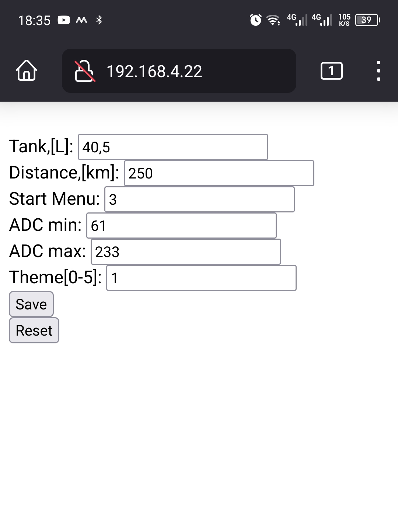
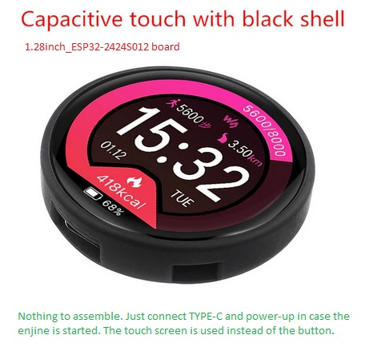

# LPG-computer

Ця схема закріплюється на зручному місці для водія.

Плату 1.28inch_ESP32-2424S012 я купував тут
https://www.aliexpress.com/item/1005005472711420.html

[Статичний IP](src/networking.h#L19) , [UDP порт](src/networking.h#L23) 
[та параметри WiFi](src/networking.h#L67) налаштовуються за вашим бажанням та мають співпадати з параметрами передатчика.
Вираховується середнє арефметичне значення датчика газу за певну кількість вимірювань.

Водій може з телефону пікллючитись до вказаної точки доступу, ввести IP та налаштувати

1. Об'єм баку в літрах
2. Пробіг в км. на повному баку
3. Номер екрану, що завантажується при старті. (Змінюється при редагуванні також на дисплеї.)
4. Мінімальне абсолютне значення датчика 
5. Максимальне абсолютне значення датчика
6. Цифра - пресет кольору для малювання рівня

 

Save - зберегти налаштування, Reset - якісь значення для початку.
Всі показники на екрані вираховуються по пропорції з урахуванням збереженних данних та абсолютного значення датчику.
дотик тач скріну в будь-якому місці - зміна режимів відображення.

Приймач

* Якщо у Вас датчик WPGH-1 з трьома дротами, то Вам необхідно зібрати та встановити також передавач (клієнт):
https://github.com/pkostik/LPG-computer/tree/main/WiFi/src/Visual%20studio%20code/Transmitter_Wemos_D1_mini

* Якщо у Вас датчик з двома дротами, що вимірює опір - такого передавача я ще не встиг зробити, можливо в майбутньому. 
Ідея доволі схожа - вимірюємо опір за допомогою відомого резистора та невідомого (вихід датчика) і надсилаємо серверу (приймачу).
+12в. беремо з електроклапану балона. 