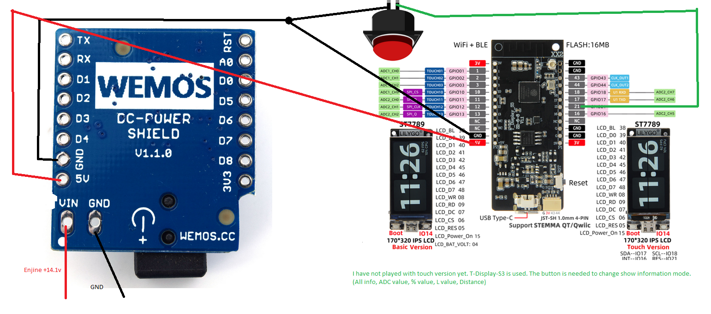

# LPG-computer

Ця схема закріплюється на зручному місці для водія. В свому Ford Fusion встановив замість монетниці.

Youtube
  https://www.youtube.com/watch?v=5OeU84SJVtE&t=1s

[Статичний IP](src/main.cpp#L34) , [UDP порт](src/main.cpp#L38) 
[та параметри WiFi](src/main.cpp#L224) налаштовуються за вашим бажанням та мають співпадати з параметрами передатчика.
Вираховується середнє арефметичне значення датчика газу за певну кількість вимірювань.
Також перевіряємо чи знаходиться виміряне значення датчика [в межах середнє значення попередніх вимірювань +-](src/main.cpp#L376) 
[TOLERANCE](src/main.cpp#L25) - прибираємо похибку при підкиданні машини на ямках, тощо.

Водій може з телефону пікллючитись до вказаної точки доступу, ввести IP та налаштувати

1. Об'єм баку в літрах
2. Пробіг в км. на повному баку
3. Номер екрану, що завантажується при старті. (Змінюється при редагуванні також на дисплеї.)
4. Мінімальне абсолютне значення датчика 
5. Максимальне абсолютне значення датчика
6. Цифра - пресет кольору для малювання рівня

 

Save - зберегти налаштування, Reset - якісь значення для початку.
Всі показники на екрані вираховуються по пропорції з урахуванням збереженних данних та абсолютного значення датчику.
Аппаратна кнопка - зміна режимів відображення.

Приймач 

* Якщо у Вас датчик WPGH-1 з трьома дротами, то Вам необхідно зібрати та встановити також передавач (клієнт):
https://github.com/pkostik/LPG-computer/tree/main/WiFi/src/Visual%20studio%20code/Transmitter_Wemos_D1_mini

* Якщо у Вас датчик з двома дротами, що вимірює опір - такого передавача я ще не встиг зробити, можливо в майбутньому. 
Ідея доволі схожа - вимірюємо опір за допомогою відомого резистора та невідомого (вихід датчика) і надсилаємо серверу (приймачу).
+12в. беремо з електроклапану балона.
