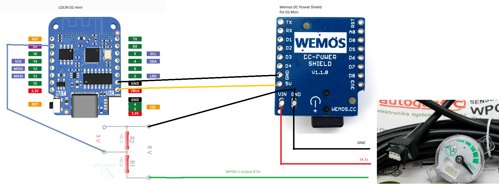

# LPG-computer

Ця схема закріплюється в центрі балону, підключається до конектору датчика Холла WPGH-1 (три дроти) паралельно.
Бажано існуючу проводку не різати, зробити на роз'ємах. 
Постійно вимірюється значення датчику газу та передається на 
[вказаний IP](src/main.cpp#L5) та [UDP порт](src/main.cpp#L10).

[Ось тут](src/main.cpp#L13) є можливість налаштувати назву точки доступу та пароль для підключення. 
Креденшили WiFi та статична адреса має співпадати з налаштуваннями серверу.

Передавач 

