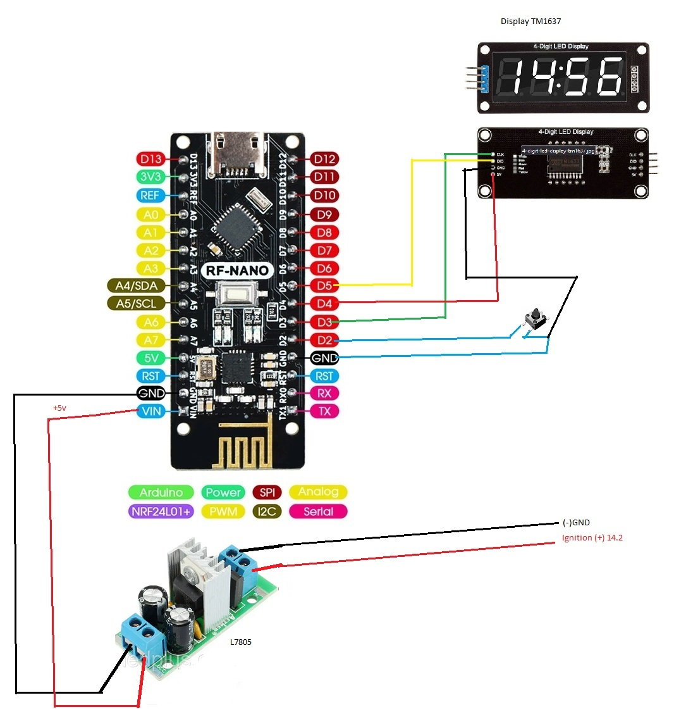
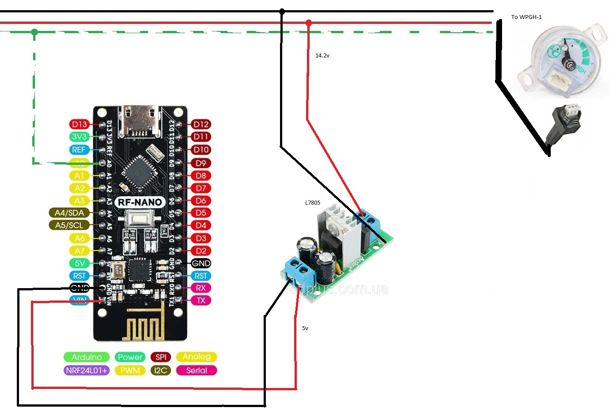

# LPG-computer

Список деталей

 1. Arduino RF-Nano V3.0 ATMega328P CH340 - 2 шт.
 2. Будь- який стабілізатор напруги до 5в. (L7805) - 2 шт.
 3. Дісплей TM1637 - 1 шт.
 4. Кнопка - 1 шт.

Робота пристрою

 Пристрій завантажується в режимі, вказаному змінною
 
    current_mode

Щосекунди програма реагує на переривання та [збільшує відлік секунд](src/Visual%20studio%20code/Receiver/src/receiver.cpp#L76). 
При вимиканні газу, коли відлік секунд перевищує [таймаут](src/Visual%20studio%20code/Receiver/src/receiver.cpp#L13) , програма вимикає дисплей.
При отриманні значення датчику по радіоканалу відлік секунд обнуляємо. Якщо дисплей вимкнуто - вмикаємо.

При натисканні кнопки перемикаємо пункти меню:

0. Абсолютне значення датчика
1. Відсоток заповнення баку газом '='
2. Залишок літрів в баку 'L'
3. Приблизний залишок кіломатрів до порожнього баку '_'
4. Вимкнути дисплей до наступного натискання кнопки меню

Калібровка значень

[Ось тут](src/Visual%20studio%20code/Receiver/src/receiver.cpp#LL23C28-L23C28) є можливість налаштувати 

1. Пункт меню за замовчуванням
2. Мінімальне абсолютне значення датчика
3. Максимальне абсолютне значення датчика
4. Пробіг в км. на повному баку
5. Об'єм баку в літрах

Приблизно так:

    int current_mode=2;          //Default menu mode
    int _min=5;                  //Minimum absolute sensor value
    int _max=1023;               //Maximum absolute sensor value
    int distance_capacity=260;   //Distance in case the tank is fully charged
    int liter_capacity=37;       //Liters in case the tank is fully charged
 
Якщо значення датчика стрибає, спробуйте в передавачу змінити [кількість вимірювань](src/Visual%20studio%20code/Transmitter/src/transmitter.cpp#L7) 
для середнього значення

    #define CALCULATION_NUMBER 15

Чи [затримку](src/Visual%20studio%20code/Transmitter/src/transmitter.cpp#L27) між вимірюваннями.

Приймач

Передавач

